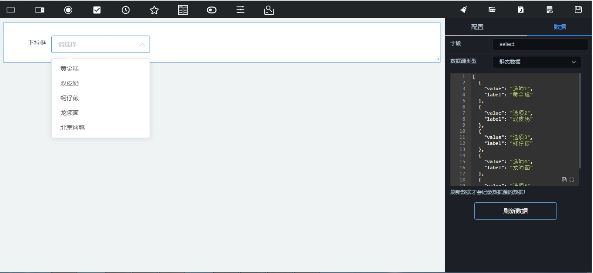
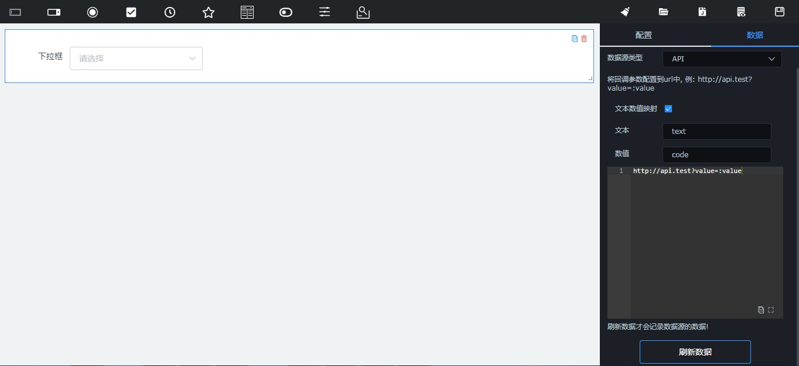

# 数据源配置
目前select,radio,checkbox和cascader组件是需要配置数据源的，数据源有两种类型，静态和API;
## 静态数据源
静态数据源通过直接编写数据

## API数据源
API通过设置url,请求的方法是Get,将回调参数配置到url中，在项目规定label表示显示的文本，value表示实际值，如果返回的字段不是这样的格式，可以开启文本数值映射。url可以是长链接，涉及到跨域的话需要做好跨域的处理，如果是短链接，请求的是与前端项目同源的数据源。需要点击刷新数据按钮才会使数据源配置生效。

